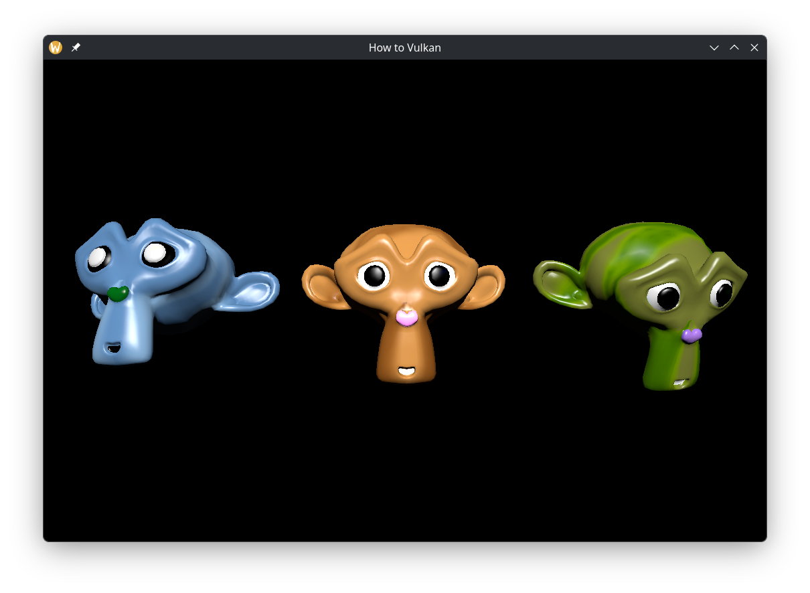

# How to Vulkan - Rust

A Rust port of [How to Vulkan][how-to-vk] tutorial by [Sascha Willems][author].

<p align="center">

</p>

Features highlight:
  * SDL3 window with Vulkan surface
  * Vulkan instance, physical device selection, logical device
  * Swapchain with dynamic rendering
  * Depth buffer
  * OBJ mesh loading with interleaved vertex/index buffer
  * KTX2 texture loading with mip maps, uploaded via staging buffers
  * Bindless texture descriptors
  * Slang shader compilation to SPIR-V at runtime
  * Phong lighting with per-instance model matrices via buffer device address
  * Synchronization with fences and semaphores
  * Mouse/keyboard input for rotating objects and moving the camera
  * Swapchain recreation on window resize
  * Proper teardown in reverse order

[Claude][] was used to port most of the C++ code.

# Usage

To run it locally, make sure to download [Vulkan SDK][vk-sdk] and source its
`setup-env.sh`, similarly to this:

```bash
# In ~/.bashrc
VULKAN_SDK_SETUP="$HOME/vulkansdk/setup-env.sh"
[[ -f "$VULKAN_SDK_SETUP" ]] && . "$VULKAN_SDK_SETUP"
```

Then simply run:

```bash
cargo run # Or `cargo run --release`
```

To select another GPU (if available), run:

```bash
cargo run 1 # Default is GPU 0
```

[how-to-vk]: https://howtovulkan.com
[author]: https://github.com/SaschaWillems
[claude]: https://claude.ai
[vk-sdk]: https://vulkan.lunarg.com/sdk/home